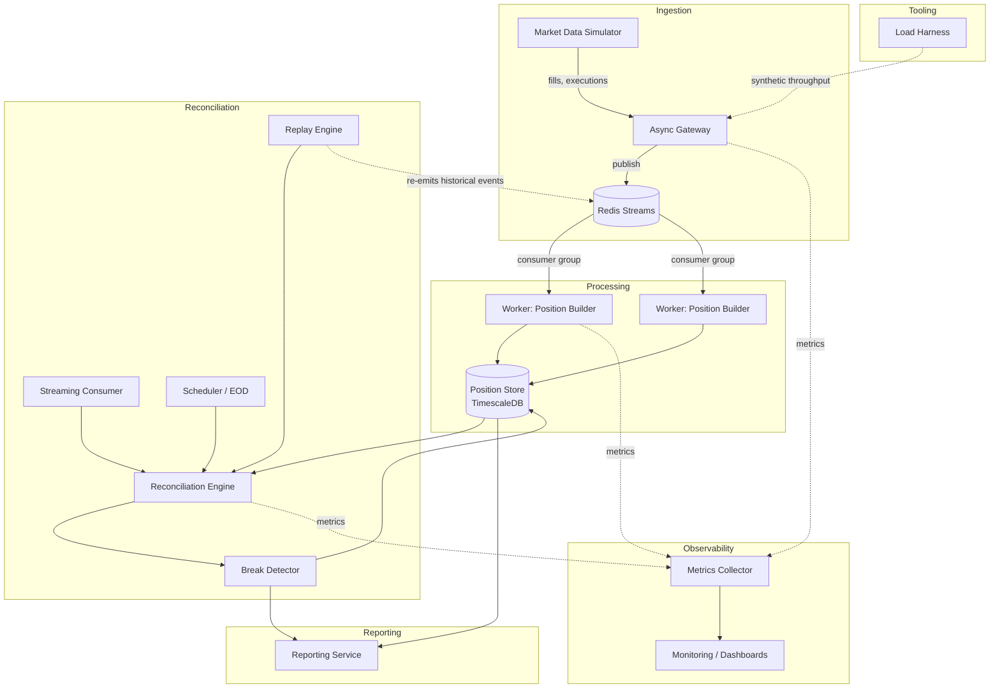
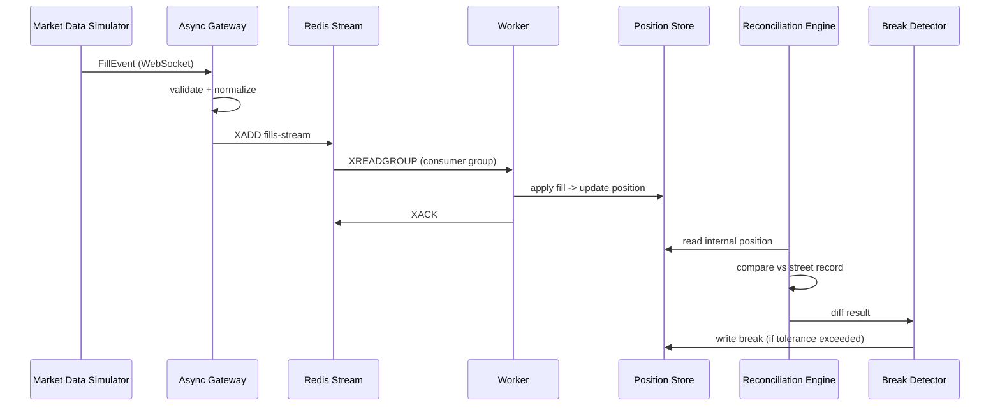

# Concord — Architecture

**Status: frozen.** Changes require a documented reason surfaced by
implementation — not convenience, and not mid-milestone second-guessing.

## Overview

Concord ingests trade activity from two independent sources of truth —
an internal blotter feed and a simulated street/exchange feed — and
continuously proves, or disproves, that they agree. When they don't,
it raises a break with enough context to investigate.

## System diagram

The Reconciliation Engine is invocation-agnostic: it takes a position
reference (and optionally an as-of time) and returns a result. It has
no knowledge of whether it was called by a live fill event, a
scheduled EOD job, or the replay engine. Streaming, scheduled, and
replay-driven reconciliation are three thin adapters over one engine —
there is exactly one implementation of "does this position match the
street," not three. As of Milestone 3, only the Scheduler/EOD adapter
(`ReconciliationScheduler`, deployed as `concord-reconciler`) exists.

## Data flow — single fill, happy path

## Repository layout

concord/
├── services/
│ ├── gateway/
│ ├── worker/
│ ├── reconciler/
│ ├── reporter/
│ └── replay/
├── libs/
│ └── concord-core/ # shared: domain models, config, metrics, logging
├── tools/
│ └── seed_demo_data.py # dev CLI: seeds paired fill histories into a running stack
├── benchmarks/ # committed, timestamped output from load/CPU benchmarks
├── infra/
│ ├── docker/
│ └── docker-compose.yml
├── tests/
│ ├── unit/
│ └── integration/
├── docs/
│ ├── architecture.md
│ └── diagrams/
├── pyproject.toml
└── README.md

Monorepo, independently deployable services, one shared core library.
`tools/` holds developer utilities, not deployable services -- no
Dockerfile, no independent pyproject.toml.

## Frozen decisions

| # | Decision | Choice | Why |
|---|---|---|---|
| 1 | Service topology | Separate services over Redis Streams | The stated goal is to experience real distributed-systems failure modes (partial failure, redelivery, consumer lag, idempotency) — a modular monolith wouldn't exercise these. |
| 2 | Time-series storage | TimescaleDB | Reconciliation is both a relational join problem (trade ↔ position ↔ break) and a time-series problem (position history, break trends). A pure TSDB would force duplicating relational data elsewhere. |
| 3 | Position state model | Event-sourced (immutable fills + snapshots) | Replayability is a first-class requirement; we already have an immutable log in Redis Streams. Read-path complexity (snapshot + replay) is an accepted cost. |
| 4 | Worker concurrency | Pure asyncio, horizontal scaling via consumer group membership | No multiprocessing until a benchmark proves the reconciliation math is CPU-bound. Optimization is driven by measurement, not assumption. |
| 5 | Reconciliation invocation | Single engine, invocation-agnostic; streaming/scheduled/replay are adapters | The engine shouldn't know or care who invoked it. One implementation of the comparison logic, not duplicated per trigger type. |

## Benchmarks

`benchmarks/` holds committed, timestamped output from the scripts in
`tools/run_*_benchmark.py`. The first of these (`run_position_benchmark.py`)
directly targets Decision 4: it measures `build_position`'s CPU cost as
fill-history size grows, since that computation runs synchronously
inside every async worker/reconciler process and blocks the event loop
for its full duration. Results there are the evidence Decision 4 should
be revisited (or confirmed) against, not further assumption.

**Baseline (2026-08-10):** confirmed linear scaling (~10,000 fills ->
~14.5ms mean, ~10x fill count -> ~10x latency, no superlinear growth).
Decision 4 stands as-is -- no multiprocessing needed at this scale.
Revisit if a real instrument's fill history reaches the order of
100,000+ fills without snapshot fold-forward existing yet, since that
would put a single `build_position` call in the ~150ms range.

## Deferred extension points

These are capabilities we anticipate might eventually be needed, but
are **not implemented and not designed yet**. Building their interfaces
now, before we've felt the actual pain they'd solve, means designing
them twice — once speculatively (wrong) and once for real. Each entry
below states the concrete condition that would justify picking it up.

- **Batching** — introduce if profiling shows per-fill reconciliation
  invocation overhead (not the reconciliation math itself) dominates
  worker throughput under load-test conditions.
- **Debounce** — introduce if metrics show the same position being
  reconciled multiple times within a sub-second window during bursty
  fill activity, producing redundant work without changing the
  outcome.
- **Backpressure** — introduce if consumer lag metrics show workers
  falling behind the fill stream under sustained load, and the load
  harness reproduces this reliably rather than as a one-off spike.
- **Prioritization** — introduce if we have multiple reconciliation
  classes with different SLAs (e.g., large-notional positions needing
  faster break detection) and evidence that FIFO processing causes
  SLA misses for the higher-priority class.
- **Latency-threshold alerting** — introduce once we have a monitoring
  baseline for "normal" reconciliation latency and a defined SLA to
  alert against.
- **Intelligent scheduling** — introduce if fixed-interval scheduling
  proves wasteful, e.g. re-running reconciliation on positions with
  zero new fills since the last run.
- **Incremental position computation (snapshot + fold-forward)** —
  introduce if a load test shows full fill-history replay (the current
  approach — see `PositionService.compute_position`) is too slow for a
  given instrument's fill volume. Until then, every computation replays
  the complete fill history, which is simpler and avoids the added
  complexity of reconciling corrections that reference fills older than
  the last snapshot.
- **Pending message reclaim (XCLAIM/XAUTOCLAIM)** — `FillIngestionConsumer`
  currently leaves a failed message unacked and simply moves on; it does
  not attempt to reclaim its own or another consumer's stuck pending
  entries. Introduce once a worker crash-recovery test demonstrates
  messages getting stuck pending long enough to matter.
- **Migration tracking (e.g. alembic)** — every migration so far has
  been an idempotent `CREATE TABLE IF NOT EXISTS`, safe to re-run in
  full on a fresh dev volume. Introduce once a schema change needs to
  alter an existing table with real data in it, rather than only ever
  adding new tables — at that point "just re-run everything" stops
  being safe.
- **Unify FillRepository / StreetFillRepository** — these two classes
  are structurally near-identical (same idempotent-insert pattern,
  same query shapes, different table name). Introduce a shared,
  table-parametrized implementation if a third similarly-shaped
  repository is needed, or if a future schema change has to be applied
  in both places and that duplication tax becomes visible in review
  time. Not unified now: doing so would mean changing `FillRepository`'s
  signature and the `FillSource` Protocol it satisfies, cascading into
  every already-tested caller for the sake of symmetry alone.
- **Streaming and replay-driven reconciliation triggers** — only the
  Scheduler/EOD adapter (`ReconciliationScheduler`) exists so far.
  Introduce a streaming trigger (reconciling an instrument immediately
  after its fill is ingested) once break-detection latency, not just
  correctness, becomes a real requirement; introduce a replay-driven
  trigger once the Replay Engine itself exists (not yet built).
- **Street-side ingestion service** — `tools/seed_demo_data.py` inserts
  street fills directly into storage rather than through any ingestion
  path, since none exists. Introduce a real street ingestion service
  (mirroring the internal Gateway/Worker path) once street data needs
  to arrive from something other than manual/demo seeding.

None of these get a box in the system diagram until the triggering
condition is observed and documented here as having occurred.