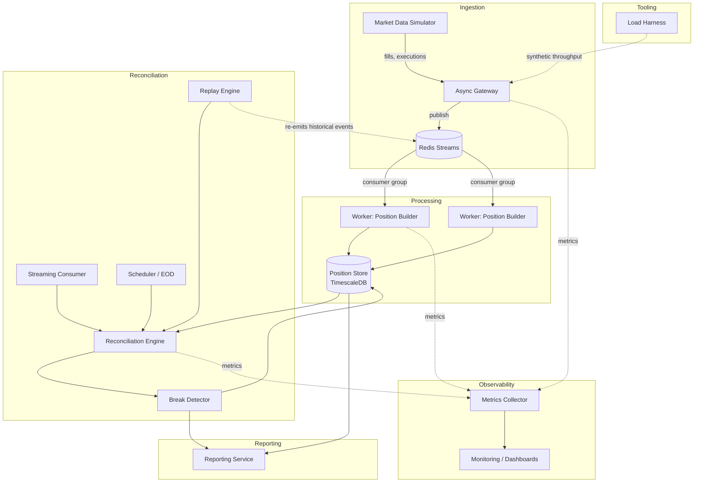
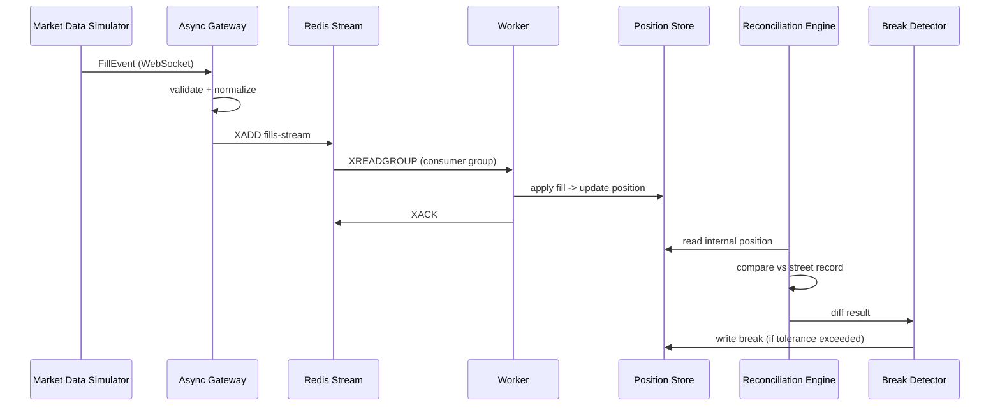

# Concord — Architecture

**Status: frozen.** Changes require a documented reason surfaced by
implementation — not convenience, and not mid-milestone second-guessing.

## Overview

Concord ingests trade activity from two independent sources of truth —
an internal blotter feed and a simulated street/exchange feed — and
continuously proves, or disproves, that they agree. When they don't,
it raises a break with enough context to investigate.

## System diagram

The Reconciliation Engine is invocation-agnostic: it takes a position
reference (and optionally an as-of time) and returns a result. It has
no knowledge of whether it was called by a live fill event, a
scheduled EOD job, or the replay engine. Streaming, scheduled, and
replay-driven reconciliation are three thin adapters over one engine —
there is exactly one implementation of "does this position match the
street," not three.

## Data flow — single fill, happy path

## Repository layout

concord/
├── services/
│   ├── gateway/
│   ├── worker/
│   ├── reconciler/
│   ├── reporter/
│   └── replay/
├── libs/
│   └── concord-core/        # shared: domain models, config, metrics, logging
├── infra/
│   ├── docker/
│   └── docker-compose.yml
├── tests/
│   ├── unit/
│   └── integration/
├── docs/
│   ├── architecture.md
│   └── diagrams/
├── pyproject.toml
└── README.md

Monorepo, independently deployable services, one shared core library.

## Frozen decisions

| # | Decision | Choice | Why |
|---|---|---|---|
| 1 | Service topology | Separate services over Redis Streams | The stated goal is to experience real distributed-systems failure modes (partial failure, redelivery, consumer lag, idempotency) — a modular monolith wouldn't exercise these. |
| 2 | Time-series storage | TimescaleDB | Reconciliation is both a relational join problem (trade ↔ position ↔ break) and a time-series problem (position history, break trends). A pure TSDB would force duplicating relational data elsewhere. |
| 3 | Position state model | Event-sourced (immutable fills + snapshots) | Replayability is a first-class requirement; we already have an immutable log in Redis Streams. Read-path complexity (snapshot + replay) is an accepted cost. |
| 4 | Worker concurrency | Pure asyncio, horizontal scaling via consumer group membership | No multiprocessing until a benchmark proves the reconciliation math is CPU-bound. Optimization is driven by measurement, not assumption. |
| 5 | Reconciliation invocation | Single engine, invocation-agnostic; streaming/scheduled/replay are adapters | The engine shouldn't know or care who invoked it. One implementation of the comparison logic, not duplicated per trigger type. |

## Deferred extension points

These are capabilities we anticipate might eventually be needed, but
are **not implemented and not designed yet**. Building their interfaces
now, before we've felt the actual pain they'd solve, means designing
them twice — once speculatively (wrong) and once for real. Each entry
below states the concrete condition that would justify picking it up.

- **Batching** — introduce if profiling shows per-fill reconciliation
  invocation overhead (not the reconciliation math itself) dominates
  worker throughput under load-test conditions.
- **Debounce** — introduce if metrics show the same position being
  reconciled multiple times within a sub-second window during bursty
  fill activity, producing redundant work without changing the
  outcome.
- **Backpressure** — introduce if consumer lag metrics show workers
  falling behind the fill stream under sustained load, and the load
  harness reproduces this reliably rather than as a one-off spike.
- **Prioritization** — introduce if we have multiple reconciliation
  classes with different SLAs (e.g., large-notional positions needing
  faster break detection) and evidence that FIFO processing causes
  SLA misses for the higher-priority class.
- **Latency-threshold alerting** — introduce once we have a monitoring
  baseline for "normal" reconciliation latency and a defined SLA to
  alert against.
- **Intelligent scheduling** — introduce if fixed-interval scheduling
  proves wasteful, e.g. re-running reconciliation on positions with
  zero new fills since the last run.
- **Incremental position computation (snapshot + fold-forward)** —
  introduce if a load test shows full fill-history replay (the current
  approach — see `PositionService.compute_position`) is too slow for a
  given instrument's fill volume. Until then, every computation replays
  the complete fill history, which is simpler and avoids the added
  complexity of reconciling corrections that reference fills older than
  the last snapshot.
- **Pending message reclaim (XCLAIM/XAUTOCLAIM)** — `FillIngestionConsumer`
  currently leaves a failed message unacked and simply moves on; it does
  not attempt to reclaim its own or another consumer's stuck pending
  entries. Introduce once a worker crash-recovery test demonstrates
  messages getting stuck pending long enough to matter.

None of these get a box in the system diagram until the triggering
condition is observed and documented here as having occurred.